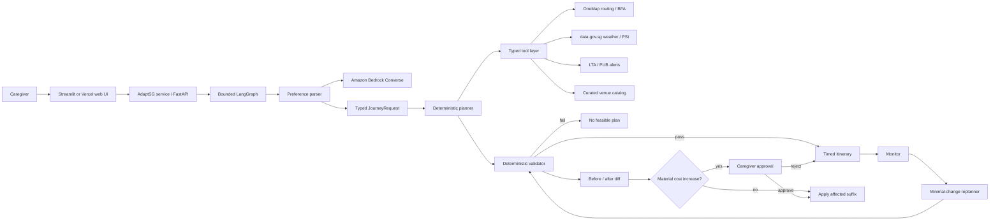
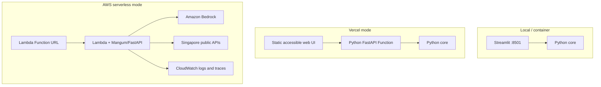

# AdaptSG Architecture

## System intent

AdaptSG serves a caregiver travelling in Singapore with an elderly or mobility-limited family member. It creates a small constraint-aware day plan, monitors changing conditions and proposes the smallest safe adjustment without silently weakening accessibility, health, timing or budget limits.

The implementation uses one bounded orchestrator, not a swarm. Bedrock interprets preferences; normal Python owns safety and feasibility.

## Component view

## State and trust boundaries

`JourneyRequest` separates `HardConstraints` from `SoftPreferences`. Hard constraints are immutable inputs to every planning cycle. Model output is parsed through a strict schema with unknown fields rejected.

`RouteLeg` requires an origin, destination, time window, walking distance, cost, source and source timestamp. `ItineraryValidator` rejects:

- missing or unverified accessibility;
- walking beyond the per-leg limit;
- timing overlap or broken route continuity;
- visits outside curated opening hours;
- missing/late lunch and excessive time without a rest opportunity;
- missing required venues;
- computed or declared cost above budget;
- declared cost that disagrees with tool-derived values;
- finishing late, too many stops or too many replans;
- route destinations that do not match catalog locations.

## Planning flow

1. The parser extracts a strict `JourneyRequest` using Bedrock Converse in live mode or a conservative deterministic parser in demo mode.
2. The planner selects no more than two activities plus an accessible lunch stop.
3. The routing tool supplies every leg's duration, distance and estimated transport cost.
4. The planner schedules each visit and totals tool/venue costs.
5. The validator accepts or rejects the complete itinerary. The graph ends after this bounded pass.

## Monitoring and replanning flow

1. The environment client retrieves weather, 24-hour PSI, PUB flood alerts and LTA train alerts with timestamps.
2. Deterministic rules translate relevant conditions into typed triggers.
3. The replanner identifies the first affected segment.
4. It preserves the unaffected prefix and generates a small candidate set for the affected suffix.
5. Each candidate is validated, then scored by number of changed segments, positive cost increase and walking distance.
6. The best feasible candidate becomes a proposal with a before/after diff.
7. A cost increase above `ADAPTSG_APPROVAL_COST_INCREASE_SGD` blocks application until caregiver approval.

Replanning is capped at two cycles by default and three at the absolute configuration limit.

## Data tools

| Tool | Purpose | Authentication | Failure behavior |
|---|---|---|---|
| [OneMap Routing](https://www.onemap.gov.sg/apidocs/routing) | Walk, public-transport and drive routes | OneMap token | Reject live verification; retain current plan |
| [OneMap BFA](https://www.onemap.gov.sg/apidocs/bfa) | Approved wheelchair-friendly walking routes | Token plus BFA approval | Do not claim accessible route |
| [data.gov.sg real-time APIs](https://guide.data.gov.sg/developer-guide/real-time-apis) | 24-hour forecast and PSI | Optional key for higher limits | Report stale/unavailable monitoring |
| [LTA DataMall](https://datamall.lta.gov.sg/content/datamall/en/dynamic-data.html) | Train disruption and PUB flood alerts | Account key | Report live verification failure |
| `venues.json` | 18 curated demo venues | Version-controlled | Exclude missing/unverified access data |

The curated catalog is demonstration data, not an official accessibility registry. Its claims must be re-verified with venue owners and OneMap BFA before production use.

## Runtime modes

### Demo

- Deterministic preference extraction, routing estimates and environment snapshot.
- No credentials or network required.
- All sources include `demo` in their provenance.
- Used by CI and the recorded five-minute demonstration.

### Live

- Bedrock Converse for preference extraction.
- OneMap routing, with BFA routing only when approved and enabled.
- data.gov.sg weather/PSI and LTA/PUB alerts.
- A provider failure stops live verification; there is no silent conversion to a live claim.

## Deployment topology

Streamlit is not deployed directly to Vercel because it expects a persistent Python process and WebSocket session. Vercel instead hosts a small static client and a Python FastAPI function backed by the same service. Docker remains the full Streamlit path.

The AWS SAM template uses Lambda, a Function URL and action-scoped Bedrock permission. The public `NONE` Function URL authorization is acceptable only for a time-boxed hackathon demo. Add IAM/Cognito, throttling and restricted CORS before any production launch.

## Current versus planned AWS services

Implemented:

- Amazon Bedrock on-demand inference;
- Lambda Function URL deployment;
- CloudWatch/X-Ray integration supplied by Lambda active tracing;
- no VPC, NAT Gateway, load balancer, EC2, RDS or provisioned throughput.

Planned after the proof of concept:

- DynamoDB on-demand for approved journey state and idempotency;
- S3 for versioned venue data and evaluation artifacts;
- structured CloudWatch metrics for tool success, latency, retained segments and loop-cap hits;
- Secrets Manager or SSM Parameter Store instead of template parameters;
- authenticated API access and per-user data retention rules.

## Observability and evaluation

The test suite enforces 20 named scenarios and records branch coverage. Production telemetry should add:

- hard-constraint violation rate (target 0%);
- feasible itinerary rate by scenario;
- percentage of unaffected segments retained;
- route/cost agreement with tool responses;
- unsupported accessibility claims (target 0);
- tool-call success and freshness;
- replanning latency and loop-cap hit rate;
- Bedrock input/output tokens and cost per plan.

No prompt content or care-related data should be logged without a retention and privacy decision.

