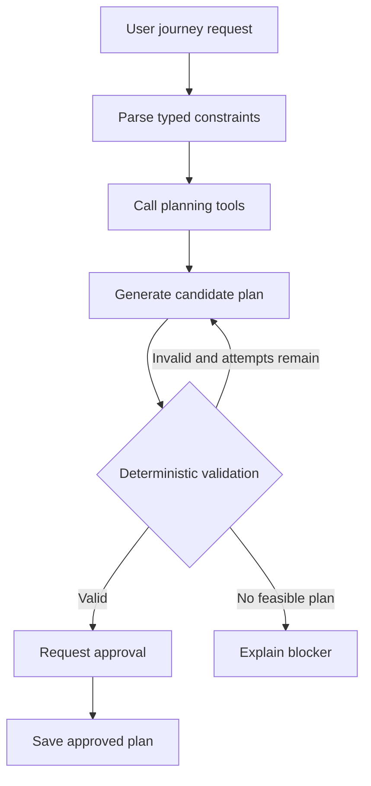
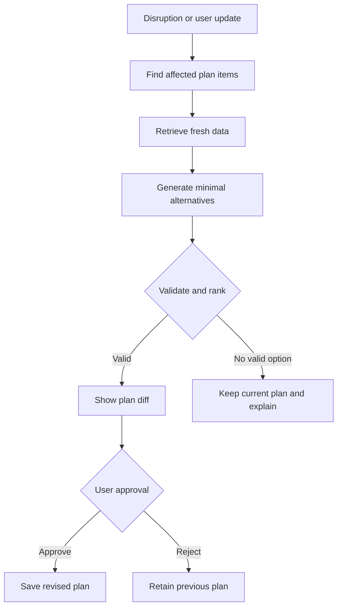
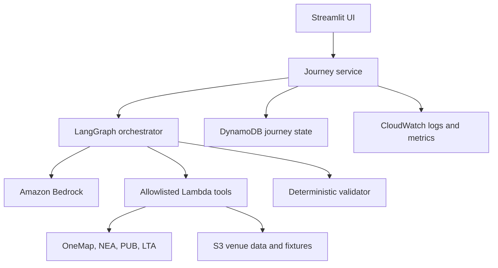

# AdaptSG Hackathon Project Brief

**Working title:** AdaptSG  
**Tagline:** An inclusive journey agent that replans when the traveller's situation changes  
**Track:** IGNITE Hackathon 2026 - Digital / Software Agentic AI  
**Team size:** Four people after initial Codex scaffolding  
**Submission date:** 7 September 2026  
**Status:** Working source of truth

---

## 1. Executive Summary

AdaptSG is a constraint-aware journey-planning agent for caregivers travelling around Singapore with an elderly or mobility-limited family member.

Ordinary route and itinerary applications optimise mainly for time, cost, or popularity. They are less effective when a journey must also respect accessibility, walking limits, rest requirements, environmental conditions, fixed appointments, and a strict budget. If rain, haze, flooding, a venue closure, or traveller fatigue changes the situation, the original plan may quickly become unusable.

AdaptSG:

1. Converts the user's natural-language request into typed hard constraints and soft preferences.
2. Calls trusted routing, accessibility, weather, PSI, flood, and venue tools.
3. Produces a timed and costed itinerary.
4. Validates the itinerary using deterministic code.
5. Detects or receives situational changes.
6. Replans only the affected portions while preserving hard constraints.
7. Shows the user the proposed changes and requests approval.

The language model proposes and explains. Deterministic code validates all time, distance, cost, accessibility, and permission requirements.

## 2. Hackathon Alignment

The IGNITE brief asks for a solution that plans, acts, and adapts over time. AdaptSG demonstrates all three capabilities:

| Capability | AdaptSG behaviour |
| --- | --- |
| Plan | Builds a journey from goals, constraints, routes, venues, and environmental information |
| Act | Calls tools, stores the plan, requests approval, and updates the accepted itinerary |
| Adapt | Identifies affected itinerary segments and proposes the smallest safe revision |

The submission is evaluated equally across five categories:

| Judging category | How AdaptSG addresses it |
| --- | --- |
| Benefits delivered | Reduces planning burden and makes journeys more usable for caregivers and mobility-limited travellers |
| Originality | Focuses on constraint preservation and minimal-change replanning rather than generic tourist recommendations |
| Effectiveness | Evaluated against golden scenarios with expected constraints, tool calls, and outcomes |
| Technical quality | Typed state, deterministic validation, bounded loops, tool allowlists, audit traces, and safe fallbacks |
| Presentation | One relatable persona, one initial plan, and two visible disruptions in a five-minute story |

Required hackathon deliverables:

- Project files or workflow, maximum 5 GB.
- Presentation deck, maximum 10 slides.
- Digital solution video, maximum 5 minutes.
- Concise README and reproducible environment setup.
- Testing and evaluation evidence in the slides.

## 3. Problem Statement

> A caregiver planning a day out with an elderly or mobility-limited family member must manually reconcile accessible routes, walking limits, weather, rest needs, opening hours, appointments, and budget. When a disruption or the traveller's condition changes, the original plan can quickly become unsafe or unusable.

### Primary persona

**Name:** Mei  
**Role:** Working adult and caregiver  
**Situation:** Planning a day in Singapore with her 72-year-old mother, who uses a wheelchair and tires easily  
**Need:** A feasible journey that remains usable when conditions change  
**Pain:** Existing plans do not automatically preserve all of her mother's constraints during replanning

### Example user request

> Plan a 10:00 a.m. to 5:00 p.m. day for me and my 72-year-old mother, starting from Toa Payoh. She uses a wheelchair, should not walk more than 400 metres in one segment, needs lunch before 1:00 p.m., needs a rest every 90 minutes, and we have a total transport and activity budget of S$70.

## 4. Solution Statement

> AdaptSG creates a constraint-aware journey plan, monitors changing conditions, and proposes the smallest safe adjustment when something changes, without silently relaxing accessibility, health-related, schedule, or budget limits.

### Product principles

1. **Hard constraints are contracts.** The system must never silently relax them.
2. **Minimal change beats total regeneration.** Preserve unaffected itinerary items where possible.
3. **Tools provide facts.** The model must not invent routes, walking distance, travel time, cost, weather, or accessibility.
4. **Deterministic code validates.** The LLM does not decide whether its own plan is valid.
5. **Humans approve material changes.** Cost increases and major itinerary revisions require confirmation.
6. **Uncertainty must be visible.** Missing or stale data is shown to the user.

## 5. Scope

### 5.1 MVP scope

- Singapore-only journeys.
- One caregiver and one elderly or mobility-limited traveller.
- Maximum three itinerary destinations.
- Start location, start/end time, and budget.
- Typed hard constraints and soft preferences.
- Curated dataset of 15 to 20 venues.
- Route lookup through OneMap or a mocked equivalent.
- Accessibility lookup through OneMap BFA or curated venue data.
- NEA weather and PSI lookup.
- PUB flood-alert lookup.
- Initial journey planning.
- Deterministic itinerary validation.
- Weather-based replanning.
- User-fatigue replanning.
- Before-and-after plan comparison.
- Human approval before applying a material revision.
- Mock fallbacks for every external dependency.
- Evaluation suite with at least 20 scenarios.

### 5.2 Explicitly out of scope

- Flight or hotel search.
- Payments or purchases.
- Real attraction, restaurant, taxi, or transport bookings.
- Medical diagnosis or medical recommendations.
- Emergency response or evacuation advice.
- Live scraping of venue websites.
- Multiple countries or unrestricted SEA travel.
- More than three concurrent AI agents.
- Autonomous messaging to external people.
- Continuous background monitoring after the demo session ends.

### 5.3 Stretch scope

Only begin stretch work after the MVP, tests, and demo path are stable:

- Interactive map.
- Live bus-arrival integration.
- Multiple valid alternatives with trade-off comparison.
- Multilingual interface.
- Reusable traveller preference profile.
- Prayer-space or dietary preference support.
- Cross-border Singapore-Johor day-trip prototype.
- MFA advisory support for future overseas journeys.

## 6. Functional Requirements

### FR-01: Capture journey request

The system shall collect:

- Origin.
- Desired destinations or activity preferences.
- Start and end time.
- Total budget.
- Number and type of travellers.
- Hard constraints.
- Soft preferences.

### FR-02: Separate hard and soft constraints

Examples:

| Hard constraints | Soft preferences |
| --- | --- |
| Wheelchair-accessible route | Prefer museums |
| Maximum 400 m walking per segment | Prefer MRT over taxi |
| Lunch before 1:00 p.m. | Minimise cost |
| Finish by 5:00 p.m. | Visit Gardens by the Bay |
| Total budget below S$70 | Avoid crowds |
| Rest every 90 minutes | Prefer scenic journeys |

The system may trade off soft preferences. It may not relax hard constraints without the user explicitly editing them.

### FR-03: Retrieve planning data

The system shall retrieve or simulate:

- Location coordinates.
- Travel routes.
- Walking distance.
- Estimated journey time.
- Accessibility status.
- Venue type and indoor/outdoor status.
- Venue duration and estimated price.
- Weather forecast.
- PSI.
- Relevant flood alerts.

### FR-04: Generate initial journey plan

The system shall produce:

- Ordered itinerary items.
- Start and end time for each item.
- Transport mode and route summary.
- Walking distance per segment.
- Estimated cost.
- Rest and meal periods.
- Source and freshness indicators.
- A concise explanation of why the plan fits the constraints.

### FR-05: Validate the plan

The deterministic validator shall reject a plan if:

- Any hard constraint is violated.
- Travel or activity times overlap.
- Total cost exceeds the budget.
- Walking distance exceeds the configured maximum.
- A required route or venue lacks verified accessibility data.
- A destination falls outside the journey time window.
- A required meal or rest interval is missing.
- Tool-derived facts are absent, expired, or malformed.

### FR-06: Handle disruptions

Supported MVP disruptions:

- Heavy rain.
- Flood alert.
- High PSI.
- Venue closure.
- Traveller becomes tired.
- Budget is reduced.
- An appointment or meal time changes.
- External API becomes unavailable.

### FR-07: Replan minimally

When a disruption occurs, the system shall:

1. Identify affected itinerary items.
2. Preserve unaffected items where feasible.
3. Generate one or more valid alternatives.
4. Reject alternatives that violate hard constraints.
5. Rank remaining alternatives deterministically.
6. Show the best alternative and its trade-offs.
7. Request approval before applying material changes.

### FR-08: Show plan differences

The UI shall show:

- Removed items.
- Added items.
- Rescheduled items.
- Transport-mode changes.
- Walking-distance changes.
- Cost changes.
- Reason for each change.

### FR-09: Human approval

Approval is required when:

- Total cost increases.
- A requested destination is removed.
- Transport changes to a more expensive mode.
- A previously approved hard constraint is edited.
- The proposed revision changes more than one major itinerary item.

### FR-10: Explain failure safely

If no feasible plan exists, the system shall:

- Keep the last approved plan unchanged.
- State which constraints make the request infeasible.
- Avoid inventing a route or accessibility claim.
- Ask the user to change one of the relevant constraints.

## 7. Non-Functional Requirements

| Area | Requirement |
| --- | --- |
| Reliability | External API failure must not crash the application |
| Safety | Hard-constraint violation rate must be 0% in the evaluation suite |
| Explainability | Every rejection and replan must include a short reason |
| Performance | Initial plans should complete within 15 seconds using mocks; replans within 10 seconds |
| Cost | Use on-demand, serverless AWS services and small Bedrock models |
| Privacy | Use synthetic demo data and store only necessary traveller information |
| Reproducibility | A clean environment must run the demo from README instructions |
| Observability | Log tool calls, validation results, iterations, latency, and token use |
| Accessibility | UI should have readable contrast, clear labels, and keyboard-friendly controls |

## 8. Agentic Workflow

### 8.1 Initial planning flow



### 8.2 Replanning flow



### 8.3 State machine

```text
REQUEST_DRAFT
-> CONSTRAINTS_CONFIRMED
-> DATA_RETRIEVED
-> PLAN_DRAFTED
-> PLAN_VALIDATED
-> PLAN_APPROVED
-> DISRUPTION_RECEIVED
-> REPLAN_DRAFTED
-> REPLAN_VALIDATED
-> REPLAN_APPROVED
```

Invalid transitions are rejected by application code. The agent cannot skip validation or approval states.

## 9. Technical Architecture



### 9.1 Component responsibilities

| Component | Responsibility |
| --- | --- |
| Streamlit UI | Collect request, display plan, simulate disruptions, show diff, collect approval |
| Journey service | Stable interface between UI, agent workflow, and persistence |
| LangGraph | Typed state, bounded plan/replan loops, routing, and approval checkpoints |
| Amazon Bedrock | Preference interpretation, candidate generation, and user-facing explanation |
| Lambda tools | Location, route, accessibility, weather, PSI, flood, and venue lookups |
| Deterministic validator | Time, cost, distance, accessibility, freshness, and constraint checks |
| DynamoDB | Journey state, plan versions, approvals, and idempotency keys |
| S3 | Curated venues, fixtures, optional source documents, and demo assets |
| CloudWatch | Tool outcomes, latency, iteration count, token usage, and errors |

### 9.2 AWS cost controls

- Deploy in `us-east-1` as required by the hackathon account.
- Use Bedrock on-demand inference only.
- Begin with Amazon Nova Lite or Claude Haiku if available.
- Use Lambda instead of EC2.
- Use DynamoDB on-demand instead of RDS.
- Use S3 or S3 Vectors instead of OpenSearch.
- Do not create NAT Gateways, load balancers, provisioned throughput, or always-on services.
- Place a hard cap on agent iterations and output tokens.
- Log per-run token use.
- Monitor the AWS budget daily; the account may be revoked after exceeding the hackathon threshold.

## 10. External and Curated Data

| Source | Purpose | MVP strategy |
| --- | --- | --- |
| OneMap Routing API | Public transport, walking, cycling, and driving routes | Real API with recorded fixtures |
| OneMap Barrier-Free Access API | Barrier-free access data | Real API where available; otherwise mark unverified |
| OneMap Nearby Transportation API | Nearby MRT and bus stops | Optional for MVP |
| LTA DataMall | Transport information | Use only if stable before code freeze |
| NEA 24-hour Weather Forecast API | Weather forecast | Real API with fallback fixture |
| NEA PSI API | Air-quality conditions | Real API with fallback fixture |
| PUB Flood Alerts API | Real-time flood events | Real API with simulated event for demo reliability |
| Curated venue JSON | Accessibility, indoor/outdoor, duration, cost, rest seating | Required deterministic MVP dataset |

### 10.1 Curated venue example

```json
{
  "venue_id": "national-gallery-singapore",
  "name": "National Gallery Singapore",
  "category": "indoor_museum",
  "location": {
    "latitude": 1.2903,
    "longitude": 103.8519
  },
  "wheelchair_accessible": true,
  "accessibility_source": "curated_fixture",
  "indoor": true,
  "average_duration_minutes": 120,
  "estimated_cost_sgd": "20.00",
  "rest_seating": true
}
```

## 11. Core Data Contracts

The initial Codex scaffold should define and test these shared Pydantic models before parallel work begins:

```python
TripRequest
TripConstraints
TravellerProfile
Venue
RouteOption
PlanItem
TripPlan
Disruption
ValidationIssue
ValidationResult
PlanDiff
ReplanResult
ToolResult
ApprovalDecision
```

### 11.1 Minimum contract expectations

`TripRequest` contains:

- Origin.
- Journey date.
- Start and end time.
- Maximum budget.
- Traveller profile.
- Requested activities.
- Hard constraints.
- Soft preferences.

`PlanItem` contains:

- Stable item ID.
- Activity or transfer type.
- Start and end time.
- Location.
- Transport mode where applicable.
- Walking distance.
- Estimated cost.
- Accessibility status.
- Source references and retrieval timestamps.

`TripPlan` contains:

- Plan ID and version.
- Ordered items.
- Total time, cost, and walking distance.
- Constraint snapshot.
- Validation result.
- Approval status.

`ToolResult` contains:

- Success status.
- Typed payload.
- Source.
- Retrieval timestamp.
- Error code and safe error message.
- Whether the value came from live data or a fixture.

## 12. Allowlisted Tools

```python
search_location(query)
get_route(start, end, mode)
get_accessibility(location_or_route)
get_weather(area, time_range)
get_psi(region)
get_flood_alerts(bounding_area)
search_venues(filters)
calculate_plan_metrics(plan)
validate_plan(plan, constraints)
save_approved_plan(plan, approval_token)
```

Tool rules:

- Tool names and descriptions are part of the prompt interface and must be precise.
- Tools return small typed results, not page dumps.
- Every external call has a timeout and safe fallback.
- The agent can only invoke tools on the allowlist.
- Saving an approved plan requires an application-issued approval token.
- No payment, booking, email, or arbitrary web-browsing tool is available in the MVP.

## 13. Deterministic Planning and Ranking

The model may propose candidates. Normal application code decides whether they are valid and how valid alternatives rank.

### 13.1 Validation order

1. Reject malformed or incomplete candidates.
2. Reject hard-constraint violations.
3. Reject time overlaps and infeasible transfers.
4. Reject budget violations.
5. Reject unverified accessibility when accessibility is mandatory.
6. Rank remaining candidates.

### 13.2 Ranking priorities

1. Safety and accessibility.
2. Schedule feasibility.
3. Minimum number of changed itinerary items.
4. Minimum additional walking.
5. Minimum additional cost.
6. Soft-preference satisfaction.

The ranking weights must be version-controlled constants, not generated by the model during a run.

## 14. Guardrails

| Risk | Required control |
| --- | --- |
| Agent forgets a constraint | Store constraints in typed state and pass them to every planner and validator node |
| Agent silently relaxes wheelchair access | Hard constraints are immutable unless the user explicitly edits them |
| Agent invents travel time, cost, or distance | Only tool results may populate numeric route fields |
| Agent claims accessibility without evidence | Unverified accessibility is shown as unknown and excluded when mandatory |
| Agent changes the entire plan unnecessarily | Replan scorer penalises changes to unaffected items |
| No feasible route exists | Stop, preserve the previous plan, and explain the conflicting constraints |
| Stale environmental information | Carry retrieval timestamps and enforce freshness limits |
| Costly alternative is introduced | Request approval before applying any cost increase |
| Infinite refine loop | Maximum two initial-plan revisions and two replan revisions |
| Prompt injection in user or venue text | User content cannot change tool permissions, system policy, or validation rules |
| External tool fails | Use a labelled fixture or return a safe failure; never fabricate a live result |
| Agent attempts payment or booking | Such tools do not exist in the allowlist |
| Fatigue is interpreted medically | Treat fatigue only as a request for reduced walking or more rest |
| Duplicate save or replan request | Use idempotency keys based on journey, event, and plan version |
| Unapproved plan is persisted as final | Persistence method requires an application-issued approval token |
| Sensitive data leaks into logs | Use synthetic demo profiles and redact free-text fields before logging |

## 15. Evaluation Plan

### 15.1 Primary metrics

| Metric | Target |
| --- | --- |
| Hard-constraint violation rate | 0% |
| Unsupported accessibility claims | 0 |
| Duplicate approved plans from retries | 0 |
| Plan validation accuracy | 100% on golden scenarios |
| Replan validation accuracy | 100% on golden scenarios |
| Feasible plan completion rate | Report measured result; do not invent target success |
| Replanning latency | Under 10 seconds with fixtures |
| Original itinerary retained | Report mean percentage across disruption scenarios |
| Tool-call success rate | Report live and fixture results separately |
| Loop-cap hit rate | Near 0%; investigate every occurrence |
| Human approval bypasses | 0 |

### 15.2 Golden scenarios

At least 20 scenarios should cover:

1. Ordinary accessible day plan.
2. Heavy rain affects one outdoor destination.
3. Flood alert affects one route.
4. High PSI removes outdoor activities.
5. Traveller becomes tired.
6. Walking limit reduced midway.
7. Budget reduced midway.
8. Lunch time moved earlier.
9. Venue closes unexpectedly.
10. Destination lacks verified accessibility.
11. No accessible route exists.
12. Routing API times out.
13. Weather API returns stale data.
14. Flood API returns no data.
15. Contradictory hard constraints.
16. User requests four destinations within an impossible time window.
17. User attempts to override the validation requirement.
18. Duplicate disruption event is submitted.
19. Cost increase requires approval.
20. User rejects the proposed replan.

Each scenario should define:

- Input.
- Expected tool calls.
- Expected hard constraints.
- Expected valid or invalid outcome.
- Expected approval requirement.
- Expected retained itinerary items.

## 16. User Experience Requirements

The interface should contain:

1. Journey-request form.
2. Hard-constraint and soft-preference editor.
3. Current conditions summary.
4. Initial itinerary timeline.
5. Cost, time, and walking summary.
6. Accessibility and data-freshness indicators.
7. Disruption simulator.
8. Before-and-after plan diff.
9. Approve and reject actions.
10. Evaluation or audit panel for the recorded demonstration.

The UI may show concise process summaries such as:

- Checking accessibility.
- Comparing three routes.
- Rejected route B because walking distance exceeds 400 metres.
- Rain affects two itinerary segments.
- Proposed adjustment adds S$8 and removes 250 metres of walking.

Do not display hidden chain-of-thought. Display actions, evidence, constraint checks, and short explanations.

## 17. Repository Structure

```text
adaptsg/
├── app.py
├── pyproject.toml
├── .env.example
├── README.md
├── src/
│   ├── schemas.py
│   ├── journey_service.py
│   ├── agent/
│   │   ├── graph.py
│   │   ├── nodes.py
│   │   ├── routers.py
│   │   └── state.py
│   ├── prompts/
│   │   ├── constraint_parser.py
│   │   ├── planner.py
│   │   └── replanner.py
│   ├── tools/
│   │   ├── interfaces.py
│   │   ├── onemap.py
│   │   ├── environment.py
│   │   ├── venues.py
│   │   └── mocks.py
│   ├── planning/
│   │   ├── metrics.py
│   │   ├── ranking.py
│   │   └── diff.py
│   ├── validation/
│   │   ├── validator.py
│   │   ├── permissions.py
│   │   └── freshness.py
│   └── evaluation/
│       ├── runner.py
│       ├── metrics.py
│       └── scenarios.py
├── ui/
│   ├── forms.py
│   ├── itinerary.py
│   ├── disruption.py
│   └── audit.py
├── data/
│   ├── venues/
│   └── fixtures/
├── tests/
│   ├── unit/
│   ├── integration/
│   └── golden/
├── evals/
├── infra/
└── docs/
```

## 18. Codex-Generated Base Before Team Split

Before the four people work in parallel, the initial Codex scaffold should include:

- Shared Pydantic schemas.
- One runnable end-to-end journey using mock data.
- LangGraph planning and replanning skeleton.
- Tool interfaces with mock implementations.
- Deterministic validator skeleton.
- Stable `JourneyService` methods.
- Minimal Streamlit request and result screen.
- Two example journeys and two disruption fixtures.
- Basic unit and integration tests.
- `.env.example` with no real secrets.
- Concise local-development README.

Freeze the initial contracts before parallel development. Schema changes require review from the owners of every affected module.

## 19. Four-Person Work Split

### Person 1: Agent and integration lead

**Owns:**

```text
src/agent/
src/prompts/
src/workflows/
src/journey_service.py
```

**Responsibilities:**

- LangGraph state and nodes.
- Initial plan workflow.
- Disruption and replanning workflow.
- Tool-selection prompts.
- Human-approval checkpoints.
- Conversation and journey memory.
- Iteration limits.
- Final module integration and merge decisions.

**Definition of done:**

- Agent consistently selects appropriate tools.
- It cannot bypass validation or approval.
- Replanning preserves unaffected itinerary items.
- It stops safely when no feasible plan exists.
- Every loop is bounded.

### Person 2: Tools, data, and deterministic planning

**Owns:**

```text
src/tools/
src/planning/
data/venues/
data/fixtures/
```

**Responsibilities:**

- OneMap location and route tools.
- Accessibility lookup.
- NEA weather and PSI tools.
- PUB flood-alert tool.
- Curated venue dataset.
- Timeouts, retries, caching, and safe fixtures.
- Deterministic travel-time, distance, and cost calculations.
- Alternative-plan ranking.

**Definition of done:**

- Every tool returns a typed `ToolResult`.
- Every external result includes source and timestamp.
- Every external dependency has a fixture fallback.
- Tool failure does not crash the application.
- Numeric facts never come from model prose.

### Person 3: Frontend and demo experience

**Owns:**

```text
ui/
app.py
assets/
```

**Responsibilities:**

- Journey-request form.
- Constraint editor.
- Initial plan timeline.
- Map or route summary.
- Weather and accessibility indicators.
- Disruption simulator.
- Plan-diff view.
- Approval controls.
- Stale-data, tool-failure, and no-feasible-plan states.
- Demo pacing and visual polish.

**Definition of done:**

- A judge can understand the user, constraints, and journey immediately.
- Hard constraints are always visible.
- Replanning differences are obvious.
- Approval and rejection work.
- The core demo takes less than three minutes.

### Person 4: Guardrails, evaluation, deployment, and presentation

**Owns:**

```text
src/validation/
src/evaluation/
tests/
evals/
infra/
docs/
```

**Responsibilities:**

- Deterministic itinerary validator.
- Permission and approval tests.
- Golden evaluation scenarios.
- Metrics collection.
- Prompt-injection and malformed-input tests.
- Idempotency and retry tests.
- AWS deployment configuration.
- Cost monitoring.
- README and architecture documentation.
- Ten-slide deck and five-minute video script.
- Final submission checklist.

**Definition of done:**

- Every benefit claim has evidence.
- Deployment is reproducible.
- Recorded demo has a fixed-fixture fallback.
- No secrets appear in the repository.
- Evaluation results are available for the slides.

## 20. File Ownership and Collaboration Rules

| Path | Primary owner |
| --- | --- |
| `src/agent/**` | Person 1 |
| `src/prompts/**` | Person 1 |
| `src/journey_service.py` | Person 1 |
| `src/tools/**` | Person 2 |
| `src/planning/**` | Person 2 |
| `data/**` | Person 2 |
| `ui/**` and `app.py` | Person 3 |
| `src/validation/**` | Person 4 |
| `src/evaluation/**` | Person 4 |
| `tests/**` and `evals/**` | Person 4, with contributions from module owners |
| `infra/**` and `docs/**` | Person 4 |
| `src/schemas.py` | Person 1; changes reviewed by all affected owners |
| `pyproject.toml` | Person 1 |
| `.env.example` | Persons 1 and 2 |
| `README.md` | Person 4 |

Collaboration rules:

- Use one feature branch per owner.
- Avoid cross-editing another owner's files without coordination.
- Merge a working vertical slice at least once per day.
- All changes must retain a runnable mock-data path.
- A pull request is not complete until its relevant tests pass.
- Do not allow multiple Codex sessions to rewrite `schemas.py`, `app.py`, or the agent graph independently.
- Freeze shared schemas after Day 1 except for blocking fixes.
- Freeze external API additions after Day 4.
- Freeze product features after Day 5.

## 21. Seven-Day Execution Plan

### Day 1: Contracts and setup

- Confirm persona, problem statement, and demo scenario.
- Review Codex scaffold.
- Freeze schemas and service interfaces.
- Verify that every module works against mocks.
- Agree on mandatory and stretch features.

**Exit condition:** One mock journey can be planned and displayed end to end.

### Days 2-3: Parallel core implementation

- Person 1 completes initial plan and replan flows.
- Person 2 connects OneMap and environmental tools.
- Person 3 completes the main planning UI.
- Person 4 builds the first ten golden scenarios and validator tests.

**Exit condition:** By the end of Day 3, one integrated plan and one integrated disruption work.

### Day 4: Disruptions and guardrails

- Add heavy-rain and traveller-fatigue scenarios.
- Enforce hard constraints.
- Add before-and-after plan diff.
- Add human approval.
- Run the initial evaluation suite.

**Exit condition:** A disruption causes a valid, explainable, approval-gated replan.

### Day 5: Reliability and deployment

- Add timeouts and fixture fallbacks.
- Add no-feasible-plan handling.
- Add duplicate-request protection.
- Add logging and metrics.
- Deploy the stable build to AWS.

**Exit condition:** The deployed build survives expected tool failures and repeated requests.

### Day 6: Presentation polish and feature freeze

- Freeze product features.
- Improve UI clarity.
- Capture evaluation results.
- Finish the architecture diagram and slides.
- Run five-minute rehearsals.

**Exit condition:** Full presentation is consistently under five minutes.

### Day 7: Recording and submission buffer

- Record the final video.
- Test setup from a clean environment.
- Review secrets and `.env` handling.
- Check file-size and slide limits.
- Upload early enough to recover from problems.

## 22. Five-Minute Demo Script

### 0:00-0:30 - Human story

Introduce Mei and her mother. Show how one ordinary day requires coordinating accessibility, walking, meals, rest, budget, and environmental conditions.

### 0:30-1:00 - Problem

Show that ordinary plans become unusable when the traveller tires or conditions change.

### 1:00-1:45 - Initial request

Enter:

- Toa Payoh origin.
- 10:00 a.m. to 5:00 p.m.
- Wheelchair access required.
- Maximum 400 m walking per segment.
- Lunch before 1:00 p.m.
- Rest every 90 minutes.
- S$70 budget.

### 1:45-2:30 - Initial plan

Show:

- Three itinerary stops.
- Route summaries.
- Walking and cost totals.
- Accessibility evidence.
- Constraint validation result.

### 2:30-3:15 - First disruption

Trigger heavy rain or a flood event. The system identifies affected outdoor segments, retrieves fresh data, and proposes an indoor substitute.

### 3:15-4:00 - Second disruption

Enter: "Mum is more tired than expected." The system reduces walking, adds rest, and proposes one taxi leg.

### 4:00-4:30 - Approval and plan diff

Show:

- Which items changed.
- Why they changed.
- Cost increase.
- Walking reduction.
- Preserved hard constraints.
- Human approval.

### 4:30-5:00 - Evidence and close

Show:

- Hard-constraint violation rate.
- Evaluation scenarios.
- Tool-call and validation traces.
- Vision for future caregivers and inclusive regional travel.

## 23. Ten-Slide Deck Outline

1. **Title and team** - AdaptSG mission and team roles.
2. **Problem and persona** - Mei, her mother, and the planning burden.
3. **Why it matters** - Inclusive travel, ageing Singapore, and the consequence of plans that fail under change.
4. **Solution overview** - Plan, act, adapt, and approve.
5. **User journey** - Initial request, plan, disruption, and replan.
6. **Technical architecture** - Bedrock, LangGraph, tools, validator, and state.
7. **Guardrails** - Hard constraints, deterministic validation, allowlists, approval, and fallbacks.
8. **Evaluation and results** - Golden scenarios and measured metrics.
9. **Demo and roadmap** - MVP evidence and future extensions.
10. **Conclusion** - One-line benefit and adoption vision.

## 24. Risk Register

| Risk | Probability | Impact | Mitigation |
| --- | --- | --- | --- |
| OneMap or government API unavailable | Medium | High | Recorded fixtures and visible live/fixture labels |
| Accessibility coverage is incomplete | High | High | Treat missing data as unverified; never infer accessibility |
| Agent produces infeasible times | Medium | High | Deterministic transfer and overlap validation |
| Agent replans too much | Medium | Medium | Minimal-change scoring and retained-item metric |
| UI becomes too complex | Medium | Medium | One persona, three stops, and two disruptions only |
| Team merge conflicts | Medium | High | Strict file ownership and frozen shared contracts |
| AWS budget is exhausted | Low | High | Serverless architecture, small model, bounded loops, daily monitoring |
| Live demo fails | Medium | High | One-click fixture mode and pre-recorded final video |
| Evaluation is left until the end | Medium | High | Person 4 begins golden scenarios on Day 2 |
| Team adds overseas scope too early | Medium | High | SEA travel remains stretch scope until MVP freeze |

## 25. Definition of Done

The MVP is complete only when:

- A user can create one Singapore journey with typed constraints.
- The system calls tools or clearly labelled fixtures.
- The initial plan passes deterministic validation.
- Heavy rain produces a minimal valid replan.
- Traveller fatigue produces a minimal valid replan.
- Every hard constraint remains satisfied.
- Material changes require human approval.
- The UI shows a before-and-after diff.
- No feasible plan results in a safe explanation, not fabrication.
- At least 20 golden scenarios run from one command.
- The evaluation reports measured results.
- The deployed and local mock versions both work.
- Setup is reproducible from the README.
- No secrets or real personal data are committed.
- The ten-slide deck and five-minute video satisfy submission limits.

## 26. Final Submission Checklist

### Code and environment

- [ ] README contains setup and run instructions.
- [ ] `pyproject.toml` or `requirements.txt` is complete.
- [ ] `.env.example` contains names only, not secrets.
- [ ] Mock-data mode works without external API keys.
- [ ] Production/live-data mode fails safely.
- [ ] Tests and golden evaluations pass.
- [ ] Repository contains no credentials or real personal data.

### Agent and guardrails

- [ ] All loops have hard iteration caps.
- [ ] All tools are allowlisted.
- [ ] Hard constraints are typed and immutable during planning.
- [ ] Validator is deterministic.
- [ ] Approval gates cannot be bypassed.
- [ ] No-feasible-plan behaviour is tested.
- [ ] Duplicate requests are idempotent.
- [ ] Source freshness is visible.

### AWS

- [ ] Correct AWS region is configured.
- [ ] Only serverless/on-demand services are used.
- [ ] Current account spending is below the threshold.
- [ ] Unused resources are removed.
- [ ] Deployment and teardown steps are documented.

### Presentation

- [ ] Deck has 10 slides or fewer.
- [ ] Video is 5 minutes or shorter.
- [ ] Value is clear in the first minute.
- [ ] Demo visibly shows planning, tool use, adaptation, and approval.
- [ ] Claims are supported by evaluation evidence.
- [ ] Captions or clear voiceover are included.
- [ ] Final video is tested on another device.

### Submission

- [ ] Project files are below 5 GB.
- [ ] All filenames are clear.
- [ ] Final archive opens successfully.
- [ ] Submission is uploaded before the deadline buffer.

## 27. Open Decisions

Resolve these on Day 1:

- Final product name: AdaptSG or another team-selected name.
- Exact three venues used in the demo.
- Whether the primary environmental event is heavy rain alone or rain plus flood alert.
- Whether the second replan uses a taxi or replaces an attraction.
- Exact approval threshold for cost increases.
- Maximum freshness age for weather, PSI, and flood data.
- Which OneMap endpoints are stable enough for the live path.
- Whether deployment uses a Lambda Function URL or Bedrock AgentCore Runtime.
- Which Bedrock model is available in the hackathon AWS account.

## 28. References

### Hackathon source material

- IGNITE Agentic AI Hackathon Functional Training Session 3, 24 August 2026.
- IGNITE Agentic AI Hackathon Session 2, 18 August 2026.
- IGNITE Agentic AI Hackathon Session 1, 17 August 2026.
- IGNITE Agentic AI Hackathon Kick-off, 14 August 2026.
- IGNITE Hackathon 2026 AWS Accounts Access Guide for Students.

### Official data and API documentation

- [OneMap Routing API](https://www.onemap.gov.sg/apidocs/routing)
- [OneMap Barrier-Free Access API](https://www.onemap.gov.sg/apidocs/bfa)
- [OneMap Nearby Transportation API](https://www.onemap.gov.sg/apidocs/nearbytransport)
- [LTA DataMall API User Guide](https://datamall.lta.gov.sg/content/dam/datamall/datasets/LTA_DataMall_API_User_Guide.pdf)
- [NEA 24-hour Weather Forecast API](https://data.gov.sg/datasets/d_ce2eb1e307bda31993c533285834ef2b/view)
- [NEA Pollutant Standards Index API](https://data.gov.sg/datasets/d_fe37906a0182569d891506e815e819b7/view)
- [PUB Flood Alerts API](https://data.gov.sg/datasets/d_f1404e08587ce555b9ea3f565e2eb9a3/view)
- [MFA Travel Advisories and Notices](https://www.mfa.gov.sg/travelling-overseas/travel-advisories-notices-and-visa-information/)

---

## One-Line Team Reminder

> Build one reliable journey that visibly survives two changes. Do not build the whole travel industry.
